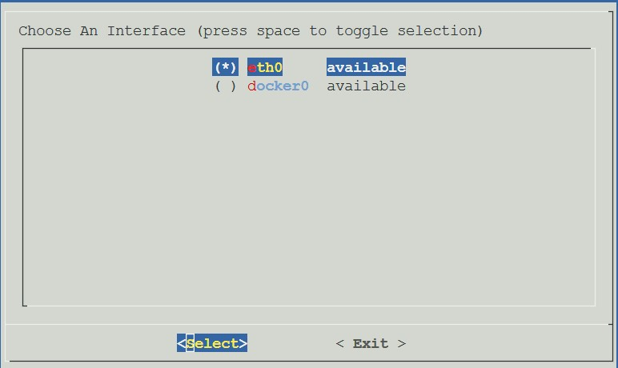
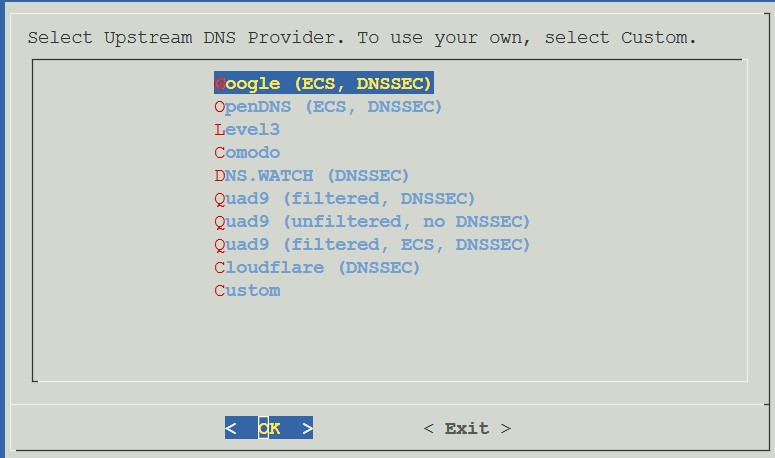
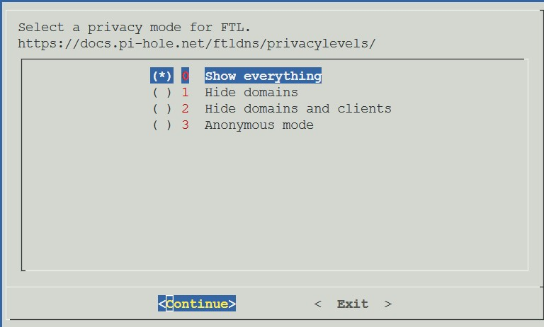
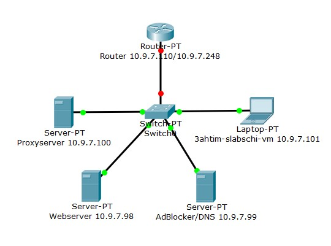

= Protokollierung des Netzwerktechnikprojekts
Maximilian Slabschi, Isabel Schnalzenberger
:toc:
:icons: font
:url-quickref: https://docs.asciidoctor.org/asciidoc/latest/syntax-quick-reference/

== Basic Infos
=== Container erstellen
* Erstellen von Container
. Allgemein
** Knoten: pve01 oder pve02 oder pve03
** CT ID: 7180
** Hostname: <klasse>-<nachname>
** Resourcepool: it......
** Kennwort: .....
. Template
** Storage: local
** Template: debian-11-standard_11.6-1_amd64.tar.zst
. Disks
** Storage: SSD-School
** Disk Größe: 8
. CPU
** Kerne: 4
.Speicher
** Speicher: 512
** Swap: 512
. Netzwerk
** Name: net0
** Bridge: vmbr<klassennummer> // siehe nvm
** IP-Adress: 10.9.7.97/24
** Gateway: 10.9.7.254

=== Container/VM starten
* Einfach einen der Container/VM's auswählen
* In dessen Menü einfach auf Start clicken um diesen zu starten

=== SSH-Verbindung:
* SSH-Verbindung ermöglichen
** User erstellen
----
add user <name>
----
** Passwort erstellen
* Im eigenen Terminal dann eingeben
----
ssh <user>@<ip-container>
----
* Nun können sie von ihrer eigenen shell auf den Container/VM zugreifen

== PiHole
=== PiHole installieren
* Zuerst erstellen sie einen Container
* Im PiHole zu installieren geben Sie zuerst folgende Befehle ein:
----
apt update

apt full-upgrade
----

* Geben sie die darunter folgenden Befehle ein.
* Gibt eine Liste mit Zeitzonen aus, auf welcher sie ihre auswählen
----
timedatectl list-timezones
----

* ihre Zeitzone einsetzen z.B. `set-timezone Europe/Berlin`
----
set-timezone <timezone>
----

* Bestätigung des ganzen
----
timedatectl
----

* Mit reboot den Container neustarten
----
reboot
----

* Nun "curl" installieren und PiHole installieren
----
apt install curl

curl -sSL https://install.pi-hole.net | bash
----

* Danach folge eine Anreihung von Aktionen
* Wenn man nichts auswählen kann einfach "Confirm" oder "Ok" mit Enter und den Pfeiltasten auswählen
* Bei folgende Dinge auswählen

* Wenn die letzten Sachen geladen haben geben ändern sie das Passwort mit:
----
pihole -a -p
----
* Damit ist die Installation geschafft.

TIP: Falls Fehler auftreten, hier nachsehen: https://blog.habitats.tech/howto-install-pi-hole-in-proxmox-ve-possibly-the-best-ad-blocker-and-privacy-protector[link]

=== PiHole einrichten (falls erwünscht)
* In Ihrem Browser geben sie die Netzwerkadresse ihres Containers ein + /admin
====
z.B. http://10.10.10.10/admin
====
* Nun sind sie auf der Übersichtsseite
* Im Router beim DNS einfach die Adresse des PiHole eingeben
* Fertig nun läuft Ihr PiHole als Dns

TIP: Für weitere informationen: https://blog.habitats.tech/howto-install-pi-hole-in-proxmox-ve-possibly-the-best-ad-blocker-and-privacy-protector[link]

== Webserver
=== Webserver Erstellen
* Geben sie (falls mit ssh verbunden) folgenden Befehl ein um als Root agieren zu können
----
su -
----

* Zuerst bringen sie Ihre Virtuelle Maschine auf den neuesten Stand und anschließend mit folgenden Befehl installieren sie ihren Webserver
----
apt update

apt install apache2

chrown -R me/var/www/html/
----

* Um eine HTML Datei zu erstellen Verwenden geben sie folgenden Befehl ein
----
nano /var/www/html/index.html
----

* Fertig nun haben sie ihren eigenen Webserver mit der Netzwerkadresse Ihres Containers + dem Namen der Html datei können sie ihre website sehen

== Router
=== Router erstellen
* Container erstellen
* net0
** IP-Adresse: <IP-Adresse>

==== Netzwerkkarte hinzufügen
* net1
** Ip-Addresse: <Gluenetzaddresse>
** Gateway: 10.9.7.254

* Gateway bei den anderen Maschninen auf die Adresse des Routers ändern

=== Gluenetz

* Nun folgende Befehle eingeben:
----
sudo apt-get update
sudo apt upgrade

cd /etc
nano sysctl.conf
----
* Mit den oberen Befehlen bringen sie alles auf den neuesten Stand
* Mit denen darunter navigieren sie in das sysctl.conf file
* Nun schreiben Sie folgendes in das File: `net.ipv4.ip_forward = 1`
* Anschließend führen sie folgende Befehle aus
----
iptables -t nat -A POSTROUTING -o eth1 -j MASQUERADE

iptables -A INPUT -i eth0 -j ACCEPT

iptables -A INPUT -i eth1 -m state --state ESTABLISHED,RELATED -j ACCEPT

iptables -A OUTPUT -j ACCEPT
----

* Um das file zu aktivieren folgenden Befehl verwenden:
----
sudo sysctl -p /etc/sysctl.conf
----

* Dann mit folgenden Befehl neustarten
----
sudo /etc/init.d/procps restart
----

* Nun sollte das Gluenetz funktionieren

== VM Desktop
* Create VM
** ISO-Image: lubuntu-22.10-desktop-amd64.iso
** Ansonsten alle Einstellungen wie gehabt

* VM Starten
** Am Desktop auf `Preferences` und dann auf `Advanced Network Configuration gehen`

TIP: Falls Wireless connection ist einfach per click auf das `-` löschen

** Dann auf `+` und _Ethernet_ auswählen
*** Darin Navigieren zu `IPv4` und dort von _automatic_ auf _manuel_ einstellen und auf `add` clicken
*** Dann die IP, Subnet, und DNS (ADBlocker) eintragen und nun sollte die internetverbindung stehen

NOTE: zum testen könnt ihr einfach auf eine beliebige Website gehen

== Netzwerkplan
